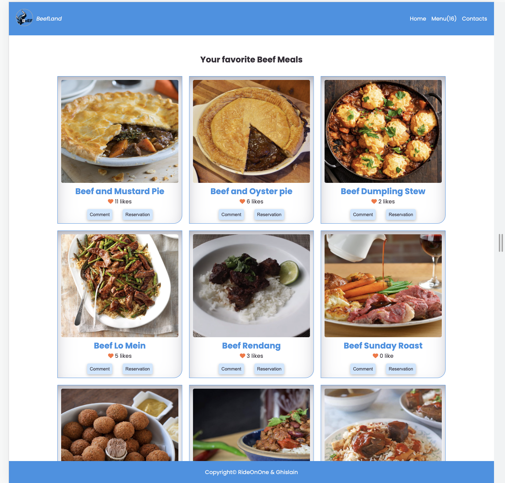

# BeefLand Menu

The BeefLand web application displays a list of meals that were provided by an external [API](https://www.themealdb.com/api/json/v1/1/filter.php?i=beef). The users can like a meal, leave some comments or make a reservation, in these cases an involvement API was used.

N.B. The reservation functions are not implemented because there are just two in the group.

This is the second Microverse capstone project meant to summarize all the content learned through module 2. The objective was to mimic the appearance of a dynamic web application, in a similar way a web developer would receive the requirements as if it were in a job.

## Project requirements 
Please find project requirements [here](https://github.com/microverseinc/curriculum-javascript/blob/main/group-capstone/js_capstone.md). 

## Project presentation
## Screenshot

## Please take a look at the video below
<!-- The zoom video -->

## How it works

The BeefLand web application allows users to like, comment, and make a reservation for their favorite meal.
* By clicking on `like button` the number of like is increased and stored in the involvement API;
* By clicking on the `Comment button` to display the description of the selected meal, the list of all comments, and added a new comment;
* By clicking on the `Reservation button` to display the list of all reservations and make a new Reservation;

## Live Demo

[Live Demo Link](https://kendoriddy.github.io/js-capstone/)

## Getting started

To get a local copy up and running follow these simple example steps:

### Prerequisites

- A device that support running browser applications.
- access to internet connection.

### Setup

#### View pages from the browser

- If you just want to check the webpage/webapp, you have it available on the live demo link.

#### Install locally the code of the application

In order to install a local version of this project and please do the following steps:
- Install the latest version of any code editor.
- install the latest version of GIT.
- open your terminal
- Go to the [repository](https://github.com/kendoriddy/js-capstone)  and clone it with `git clone git@github.com/kendoriddy/js-capstone.git' .
- open the repository cloned with `cd js-capstone`
- if your code editor is VsCode type `code .`
- Install webpack with: `npm install --save-dev webpack webpack-cli`
- To run it type `nmp run start` or run live server from the docs directory
- To test it `npm run test`
- and enjoy!

## Technologies Used

- CSS
- HTML
- JAVASCRIPT
- Webpack
- GitHub
- VsCode
- nodejs
- GIT
# Project Name

> Description the project.

## Authors

👤 **Kehinde Onifade**

- GitHub: [@githubhandle](https://github.com/kendoriddy)
- Twitter: [@twitterhandle](https://twitter.com/rideonone09)
- LinkedIn: [LinkedIn](https://www.linkedin.com/in/kehindeonifade/)

👤 **Ghislain Mitahi**

- GitHub: [@GhislainMitahi](https://github.com/GhislainMitahi)
- Twitter: [@GMItahi](https://https://twitter.com/GMitahi)
- LinkedIn: [ghislainmitahi](https://linkedin.com/in/ghislain-mitahi/)

## 🤝 Contributing

Contributions, issues, and feature requests are welcome!

Feel free to check the [issues page](../../issues/).

## Show your support

Give a ⭐️ if you like this project!

## Acknowledgments

- Hat tip to anyone whose code was used
- Inspiration
- etc

## 📝 License

This project is [MIT](https://github.com/microverseinc/readme-template/blob/master/MIT.md) licensed
